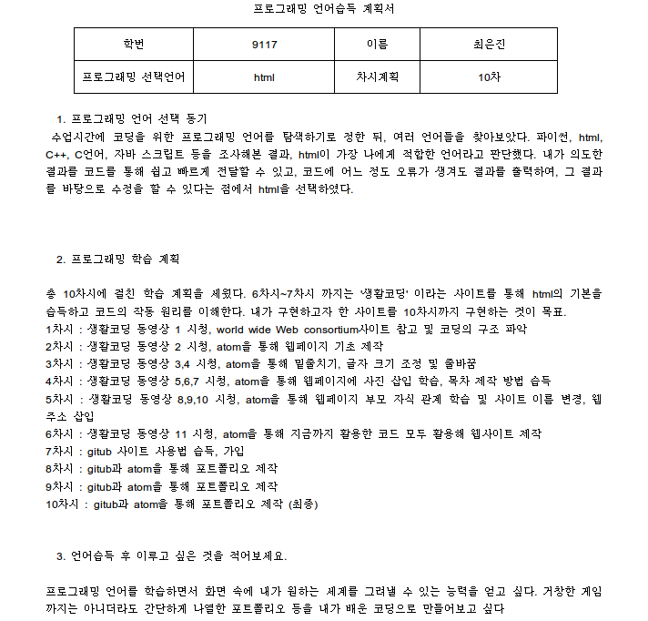

<!DOCTYPE html>
<html>
<head>
<h1>정보 포트폴리오</h1>
<meta charset="utf-8">
</head>
<body>
<h1>HTML 정보 포트폴리오</h1>
9117 최은진 

<ul>
<li><h2>프로그래밍 언어습득 계획서</h2>
  
  </li></ul>
<li><h2>1차시</h2>
  
    생활코딩 동영상 1 시청을 통해 HTML이 무엇인지,어떻게 사용되는 지 등을 배우고,  <a href="https://www.w3.org/" target="_blank" title="html5 specification">html</a>사이트를 방문하여 웹사이트의 코딩 구조를 배움 
</li>
<li><h2>2차시</h2>
  
    
    <strong>1팀 발표</strong> : 생활 코딩 웹사이트를 찾아 html의 기본 지식을 동영상을 통해 습득함, 에디터 atom을 활용해 웹페이지를 제작 
 생활코딩 동영상 2 시청을 통해 atom을 알게 됨. 또한, atom을 이용하여 웹페이지의 기초를 제작함 
  기본적인 문법 태그를 학습 및 응용하여 글자에 효과를 더함 
  줄바꿈br, 글씨 크기 변화h1~h6, 굵기변화 및 강strong, 밑줄긋기u 
</li>
<li><h2>3차시</h2></li>
 <strong>2팀 발표</strong> : 아톰이라는 프로그램을 통해 html과 css의 기본을 습득, 인터넷 강의를 통해 웹사이트 제작의 기초 터득 

 생활코딩 동영상 3,4 시청,아톰 프로그램에서 글씨 크기 조절, 목차 나열방법과 제목 등을 사용해 웹페이지를 구성함.   단락 바꿈 p, style="margin-top:45px,", ul, 목차나열 li

<li><h2>4차시</h2></li>
 <strong>3팀 발표</strong> : 발표함 

생활코딩 동영상 5,6,7 시청, atom을 통해 웹페이지에 사진을 삽입하는 방법 학습 및 웹페이지에서 내용이 저장되는 방식 이해 사진 첨부 태그 img src="" 

<li><h2>5차시</h2></li>
 <strong>4팀 발표</strong> : 코딩에 있어서 기초적이고 중요한 문법인 태그에 대하여 학습, 열림 태그 및 닫힘 태그, 글 밑줄치기 및 굵기 변경 학습 

생활코딩 동영상 8,9,10 시청, atom을 통해 웹페이지 부모 자식 관계 학습 및 사이트 이름 변, 웹 주소 삽입을 배움. 부모 자식 관계 태그 : parent--> p, a 태그, 제목변경 title 태그 , 문자가 깨질 시에 해결방법인 meta charset="utf-8", 본문 body와 머리 head, 하이퍼링크 a href="https://www.w3.org/" target="_blank" title="html5 specification">Hypertext Markup Language (HTML)/a, 마지막으로 !doctype html 

<li><h2>6차시</h2></li>

 생활코딩 동영상 11 시청, atom을 통해 그동안 학습한 태그들을 모두 복습, 웹페이지(포트폴리오)작성 

  
<li><h2>7차시</h2></li>

 생활코딩 동영상 12 시청, gitub 이라는 새로운 사이트를 알게 됨. 사이트의 사용법과 목적 학습, 가입 

  
<li><h2>8차시</h2></li>

 gitub을 통한 웹사이트 제작 및 보완 

<li><h2>9차시</h2></li>

 gitub을 통한 포트폴리오 제작 및 보충 

</body>
</html>
